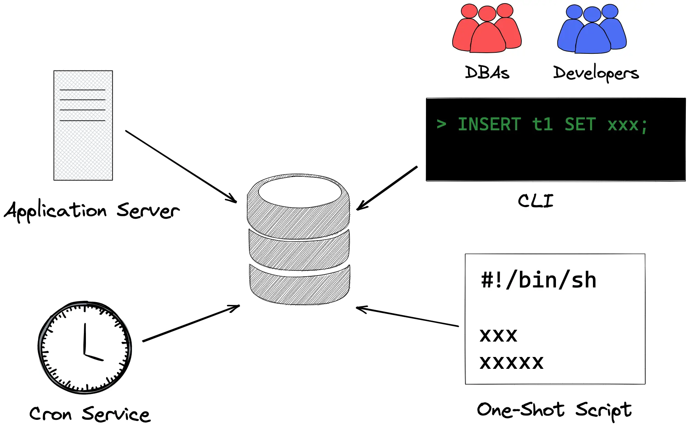

# 📦 Database Change Management Logcomex

Este repositório é responsável pelo versionamento, revisão e execução segura de alterações em banco de dados via scripts SQL. O objetivo é garantir rastreabilidade, controle de alterações e revisão por pares antes da execução em ambientes sensíveis (ex: produção).

---

## 🛠️ Como funciona'

1. Crie um arquivo `.sql` na pasta `migrations/` seguindo o padrão de nomenclatura:
   ```
   YYYY-MM-DD_nome_da_mudanca.sql
   ```
   Exemplo: `2025-06-26_add_trial_plan.sql`

2. Utilize o template padrão disponível em:
   ```
   templates/migration_template.sql
   ```

3. Submeta um **Pull Request** com:
   - Descrição clara da alteração proposta
   - Estimativa de impacto (linhas afetadas, tabelas, registros, etc.)
   - Avaliação de riscos (ex: duplicidade, integridade referencial, etc.)
   - Marcação dos revisores necessários (`@dba`, `@techlead`, `@arquiteto`)

4. Após aprovação, o script será executado **manualmente por responsável autorizado** ou via **pipeline automatizado**, quando disponível.

---

## 🔁 Processo de Submissão

1. **Crie uma nova branch para a alteração:**
   ```bash
   git checkout -b feature/2025-06-26-add-trial-plan
   ```

2. **Crie o script `.sql` na pasta `migrations/` baseado no template.**

3. **Preencha os metadados no cabeçalho do SQL.**  
   Exemplo:
   ```sql
   -- ========================================
   -- Autor: Alexandre Alfa
   -- Database: db-api
   -- Data: 2025-06-26
   -- Objetivo: Inserir plano trial do produto X
   -- Produto: Service ID 44 (nome do serviço)
   -- Impacto estimado: ~500 linhas em customer_plan
   -- Riscos: Evitar duplicidade de planos já ativos
   -- ========================================
   ```

4. **Crie um Pull Request contendo:**
   - Título descritivo (ex: `feat: inserir trial para clientes sem plano ativo`)
   - Corpo explicando o que será alterado e por quê
   - Marque os revisores técnicos e operacionais necessários (`@dba`, `@techlead`)

5. **Execução do script:**
   - Acontece **somente após aprovação formal**.
   - A execução será registrada com o número do PR ou commit hash para auditoria futura.

---

## ✅ Boas práticas

- Nunca envie `DELETE` ou `UPDATE` sem cláusula `WHERE`.
- Teste previamente seus scripts em ambiente de desenvolvimento.
- Sempre que possível, utilize `SELECT` de validação antes de `INSERT`.
- Preencha o cabeçalho com **objetivo, impacto e riscos** claramente.
- Prefira `SELECT 1` em subqueries com `EXISTS`/`NOT EXISTS`.
- Use transações (`BEGIN; COMMIT;`) quando fizer múltiplas alterações relacionadas.

---

## 📁 Estrutura recomendada

```plaintext
migrations/
├── 2025-06-26_add_trial_plan.sql
├── 2025-06-18_update_customer_status.sql
└── ...
templates/
└── migration_template.sql
.github/
└── pull_request_template.md
README.md
```

---

## 🚀 Futuras melhorias

- Integração com GitHub Actions para validação de sintaxe SQL
- Execução automatizada via pipeline (CI/CD)
- Suporte a múltiplos bancos (`db-core`, `db-analytics`, etc.)

---

Para dúvidas, sugestões ou melhorias, fale com o time de dados ou arquitetura.  
**Responsável técnico:** @alexandre-alfa
